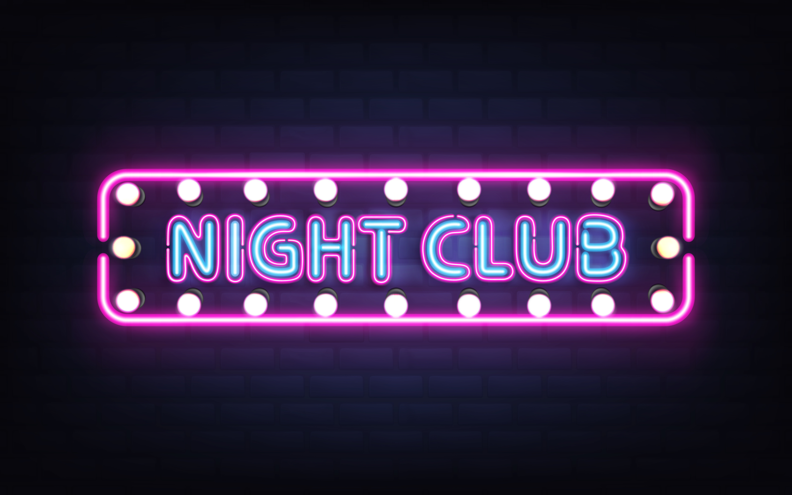

<h1 align="center">
Wheel of Doom. Night Club

</h1>

## Desarrollado por

* Minerva1922
* silvanacinthia
* Jezabel-Culvi

## Descripción
Con Wheel of Doom Night Club podemos escoger aleatoriamente el nombre de una persona, la cual será elegida para el propósito que elija el usuario.
También podemos activar o desactivar el modo noche desde la web.
En una posterior actualización podremos generar y dividir en grupos aleatorios a los participantes.

## Tecnologías aplicadas

* Github
* Trello
* Visual Studio Code
* IntelliJ
* HTML5
* CSS3
* Javascript

## :hammer:Funcionalidades del proyecto
* `Funcionalidad 1`: Elegir una persona de forma aleatoria. 
* `Funcionalidad 2`: Activar desactivar el modo noche. 
* `Funcionalidad 2a`: Desactivar el modo noche.
* `Funcionalidad 3`: :construction: Crear grupos de personas aleatoriamente según los         participantes :construction:
